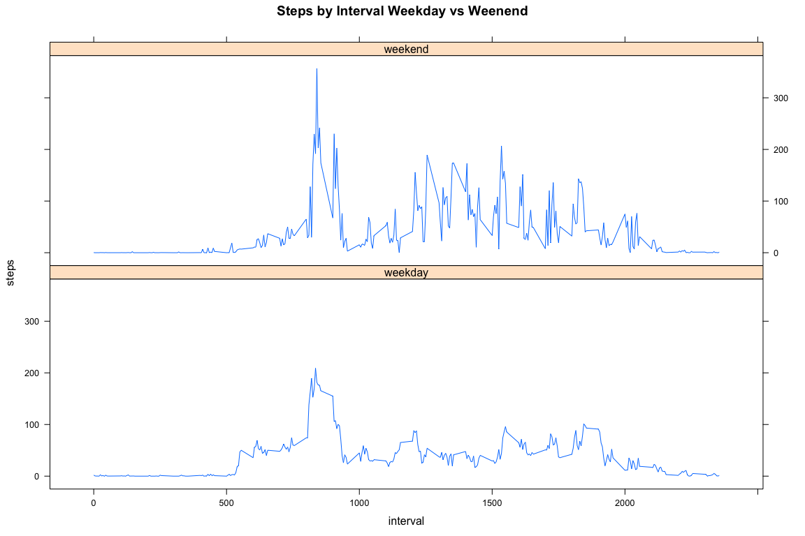

# Reproducible Research: Peer Assessment 1


```r
library(knitr)
```

```
## Warning: package 'knitr' was built under R version 3.1.2
```


## Loading and preprocessing the data


```r
  temp <- tempfile()
  fileURL <- "https://d396qusza40orc.cloudfront.net/repdata%2Fdata%2Factivity.zip"
  download.file(fileURL,temp, method="curl")
  data <- read.csv(unz(temp,"activity.csv"))
  unlink(temp)
```

***Summary of data***


```
## 'data.frame':	17568 obs. of  3 variables:
##  $ steps   : int  NA NA NA NA NA NA NA NA NA NA ...
##  $ date    : Factor w/ 61 levels "2012-10-01","2012-10-02",..: 1 1 1 1 1 1 1 1 1 1 ...
##  $ interval: int  0 5 10 15 20 25 30 35 40 45 ...
```

***Converting date from factor to date format***


```r
  data$dt <- as.Date(data$date,format="%Y-%m-%d")
```

## What is mean total number of steps taken per day?

  ***Histogram of total number of steps per day***
  

```r
  totalStepsByDay <- aggregate(steps ~ dt, data=data, FUN=sum, na.action=na.pass, na.rm=TRUE)
  plot(
      totalStepsByDay$dt, 
      totalStepsByDay$steps, 
      type="h", 
      main="Total Steps Per Day", 
      xlab="Day", 
      ylab="Steps",
      lwd=3
    )
```

 

***Mean and Median of total number of steps per day***


```r
  meanOld=mean(totalStepsByDay$steps)
  medianOld=median(totalStepsByDay$steps)
```

Mean of total number of steps taken per day is **9354.23**

Median of total number of steps taken per day is **10395**

## What is the average daily activity pattern?

***Plot for activity pattern***


```r
  avgStepsByInterval <- aggregate(data$steps, by=list(data$interval), FUN=mean, na.action=na.pass, na.rm=TRUE)
  names(avgStepsByInterval) <- c("interval","meansteps")

  plot(
      avgStepsByInterval$interval, 
      avgStepsByInterval$meansteps, 
      type="l", 
      main="Average Daily Activity Pattern", 
      xlab="Interval", 
      ylab="Average Steps"
    )
```

 

***5 minute interval that contains max value***


```r
  out <- avgStepsByInterval[order(-avgStepsByInterval$meansteps),][1,]
```

5 minute interval that contains max value is **835** with mean of **206.1698**

## Imputing missing values

***Number of missing values in the dataset***


```r
  summ <- apply(data, 2, function(x) length(which(is.na(x))))
```

Total number of rows with NA is **2304**

***Strategy for filling missing values***

Method used: mean of records without NA for each time interval across a all day


```r
  stepsFiller <- aggregate(data$steps, by=list(data$interval), FUN=mean, na.action=na.omit, na.rm=TRUE)
  names(stepsFiller) <- c("interval","steps")
  mergedData <- merge(data, stepsFiller, by="interval", all.x=TRUE)
  mergedData$finalSteps <- ifelse(is.na(mergedData$steps.x)==TRUE, mergedData$steps.y, mergedData$steps.x)
```

***Dataset with missing values filled***


```r
  newData <- data.frame(interval=mergedData$interval,date=as.Date(mergedData$date,format="%Y-%m-%d"),steps=mergedData$finalSteps)
```

***Histogram of total number of steps taken each day after filling missing values***


```r
  totalStepsByDayNew <- aggregate(steps ~ date, data=newData, FUN=sum, na.action=na.pass, na.rm=TRUE)
  plot(
      totalStepsByDayNew$date, 
      totalStepsByDayNew$steps, 
      type="h", 
      main="Total Steps Per Day", 
      xlab="Day", 
      ylab="Steps",
      lwd=3
    )
```

 

***Difference in Mean and Median***


```r
  meanNew=mean(totalStepsByDayNew$steps)
  medianNew=median(totalStepsByDayNew$steps)
```

Mean of total number of steps taken per day is **10766.19** after filling missing data

Median of total number of steps taken per day is **10766.19** after filling missing data

Difference in mean before and after filling missing values is **1411.959**

Difference in median before and after filling missing values is **371.1887**

## Are there differences in activity patterns between weekdays and weekends?

***Weekdays and Weekends variables in dataset***


```r
  library(lubridate)
  library(plyr)
  newData$dtype<-ifelse(wday(newData$date)==c(6,7), "weekend", "weekday")
  finalData <- ddply(newData,dtype~interval,summarise,steps=mean(steps))
```

***Panel plot of 5 minute interval against average number of steps***


```r
  library(lattice)
  xyplot(steps~interval|dtype, type="l", layout=c(1,2),data=finalData,main="Steps by Interval Weekday vs Weenend")
```

 

 
